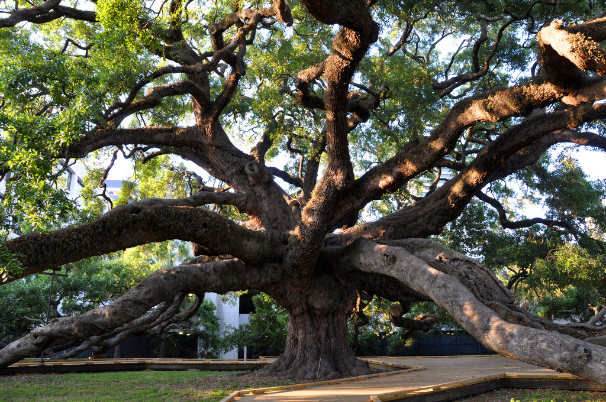

# Awesome Beard
 

 

Movember 2024, the month of mustaches, was a hit in Jacksonville. Anomaly
Periodic News dispatched senior whiskers reporter Bo Brummel to report on the
happenings.

Brummel began his tour in the Five Points, taking note of the fine facial hair
the boys and girls sported there. Sadly, his trip through Springfield was a
little disappointing. Avondale offered an exquisite example of a Snidely
Whiplash, waxed to perfection. But San Marco took the prize. Brummel met a group
of very stylish men by the Three Lions Statue. These were no ordinary
hipster-beards and mustaches. There were braided beards, two-tiered beard and
moustache designs, beads and ribbons - a display of style unlike any other.
Brummel knew he had to get the story.

Brummel got the story, and more. Although the men spoke freely, they asked him
to withhold publication until the days began to lengthen. Now, with Yule behind
us, this is their story.

**APN** Gentlemen, awesome beards and moustaches! Can we talk?

**LEIF** [Exclamation in foreign language, draws axe from cloak.]

**ERIK** [Says something to Leif. Leif looks sullen, lowers axe.]

**HARALD** Hail, spectacled one! Well met. Excuse my companions. They don't
speak this tongue.

**APN** Hail, ah ..

**HARALD** Harald

**APN** Hail, Harald! You guys have some outstanding facial hair. Are you here
in Jax for Movemeber?

**HARALD** Is that the rite to fix your river?

**APN** Our river? No, Movember is a celebration of moustaches and charitable
works.

**HARALD** Fixing your river would be a charitable work. It flows backwards.
Spoiled our triumphant entrance with your strange tides.

**ERIK** [Gestures to an empty horn]

**HARALD** [Nods to Erik] Yes, and your meadery is gone. Still, Heidr was right
about the Tree.

**APN** The tree?

**HARALD** The Tree, Yggdrasil. A few branches poke out here. That's why we
came. Let us feast and tell the tale.

**Brummel** Harald and the Bearded Ones led me towards the Southbank. We stopped
a few blocks away beneath the Treaty Oak. Harald sat on one of the lower
branches, ready to talk, but by this point Erik was waving the empty horn
violently. Leif was sharpening his axe. The others were nervous, twisting their
beards and shooting unpleasant glances my way. I took out my phone and called
APN HQ. Half an hour later, interns and editors arrived with kegs, BBQ, and even
a few napkins.Erik filled his horn. Leif chopped up the BBQ, and everyone looked
happier.

**HARALD** A fine feast! The skalds will sing of this. Now, about the Tree. As
you know, Yggdrasil joins the Nine Worlds. In this world the Tree is usually
hidden from sight, although its force still radiates. You must have noticed
strange events nearby. Shifting weather, nature's raw power. Why, Sigurd even
swears that is why your river runs north.

**SIGURD** [Waves to us.]

**HARALD** This fine oak we are sitting on is just the tip of a tiny branch of
Yggdrasil. Heidr, our seeress, sent us to gather acorns at the Winter Solstice.
We know, we know. The nuts have already fallen, but they can only be gathered
then. We know not to argue with a seer and Heidr is the best. We left home early
 because the sea crossing is long, but we rode the winds of a fine storm and
 arrived sooner than expected.

**APN** You rowed from Europe in a longship to pick acorns?

**HARALD** Exactly. San Marco is a fine district for rowing, and you can see
this Tree is like no other. But camping this long is wearisome and the men are
getting restless. Soon it will be time for us to sail for home again.

**Brummel** We talked until well into the night. Slowly the APN staff drifted
away. The Bearded Ones left for their campsites. When JSO finally arrived, only
Harald and I were left by the Treaty Oak. Or maybe not. A flying axe took out a
streetlight as the squad car approached. I shouted "Thanks" to Leif and ran off
into the night.