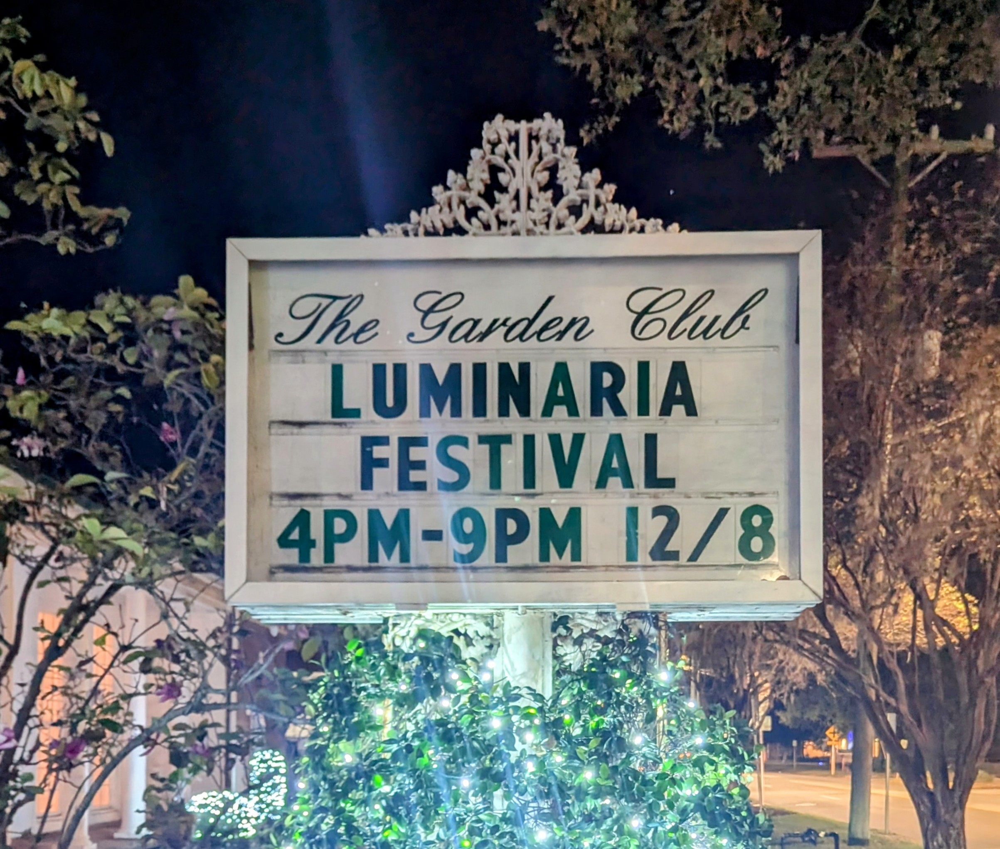

# (Il)uminaria
 
<kdb></kbd>
 

Riverside was born of fire. The flames took Jacksonville in 1901. Those who
could, abandoned the downtown. The rich and powerful built the mansions and
estates that line the river today. The really powerful placed the wards that
protect the area today.

Recent discoveries shed new light on those dark days and reveal the meaning of
Luminaria.

This year is the 40th anniversary of Riverside Luminaria. Workers sprucing up
Garden Club grounds for the party found a mysterious strongbox beneath one of
the original garden walls. The wall was crumbling and decayed from years of
storms and damp. Strangely, the iron box was free of rust. The decades spent
hidden in the mud beneath the wall hadn't aged it at all.

By chance, one of the workers had interned at Periodic News some years ago. She
recognized the importance of the find and called Anomaly News. Our intrepid
reporter arrived just in time to witness the box opening. The well-worn journal
inside was mostly sound. The ink was a little faded, and much of the writing was
in code. The pages were full of dried, pressed flowers including a now extinct
variety of Lobelia cardinalis not seen since the 1980s.

After some spirited discussion, the strongbox and its fading contents were
entrusted to our team for further investigation. The journal appears to be some
sort of log book. Its coded entries are difficult to decipher. The first entries
are very, very old - dating back to the earliest days of Riverside. The last
ones were written in the mid-80s.

Full investigation will take some time. Time we may not have. Early journal
entries from the first years after the fire indicate elaborate preparations for
ome sort of ritual. Names are hidden. Details are lacking. Never-the-less, the
scale is clear. It seems the Five Points intersection is the focal point for
some powerful spell. Those early pages are unclear, but the ritual appears to
have been a success. At least at first.

There are only sporadic entries until the 1920s.Starting around 1926, there was
a flurry of activity. Multiple authors left maddeningly indecipherable records.
Something about renewal, about reinforcement. Something seems to have been
leaking through, but what, and where? The authors' coded entries don't reveal
much. Certain indications suggest a link to the Riverside Theater building and a
lens of some kind. Perhaps there is a connection with the Sun-Ray Amulet?
(See the September issue.)

The journal was mostly quiet until the 1980s. Then something went very wrong.
The encoding is rushed, the entries sloppy. It was back. It was leaking through
again. Powerful figures at the Garden Club took the lead to renew the wards.

Powerful as they were, the Garden Club leaders lacked the strength of the
earlier Riverside protectors. Not surprisingly, they seem to have used flowers
in their rituals. When the  Lobelia cardinalis variety went extinct in the early
1980s they needed another solution. They found a way to harness the energy from
ley lines that pass under Riverside Avenue and that radiate through Riverside.

Luminaria is the method. The candles lining the streets brighten Riverside. The
brightly lit candles raise energy in the community and, perhaps more
importantly, they draw eldritch energy from the ley lines. RAP (Riverside
Avondale Preservation) and the Garden Club use these innocent looking bags of
sand to harness the energy needed to protect Riverside for another year.

Or so we think. The journal isn't clear. There is good evidence that Luminaria
is a ritual, most likely a protective ward. Most likely.

It rained on Luminaria last year, ruining the event.

We lost the Sun-Ray amulet this year.

Will this year's Luminaria be enough?