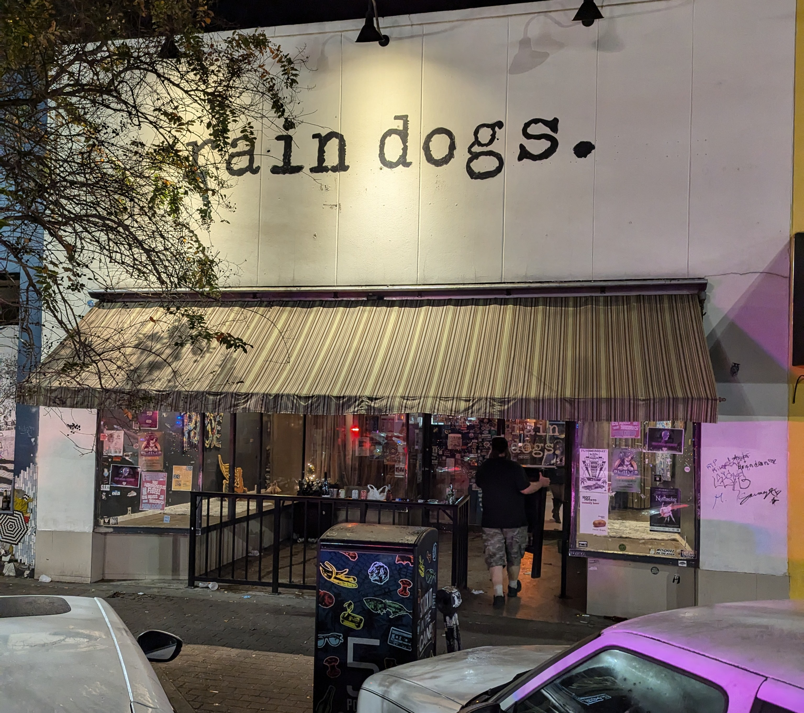

# The Storm
***Rain Dogs last call, December 31, 2024***
 

<kbd></kbd>

 

The storm has passed. The story can be told.

Winds were firece that Thursday. The Anomaly News staff was working
late, listening to the rain driving against the windows and dreading the
trip home.

Deadlines met, the staff filtered out. The wind howled in the streets,
but the damage was light. Inside a broken clock, our favorite intern
discovered a bottle, stashed who knows when, but perfect for the moment.

Splashing the wine into paper cups, we began the march homeward. But we
all sensed something was wrong. Nervous glances, cold shivers, and dark
forebodings told us the storm wasn't the only force at work.

With all the rain, dogs were howling in the streets, under stairs, in
hidden corners.

A hurried consultation, Uber? Taxi? We'd rather walk. The interns were
nervous, but our Editor counseled courage. We pressed on.

So did the rain. The skies opened and rain poured down. We had no
choice, "Huddle a doorway with the rain dogs," screamed the Editor. We
ran for the shelter of an abandoned warehouse.

The building was locked, but we found shelter on the loading dock.

Then it got weird.

The storm grew closer. The only light was a bulb in the corner, the
remnant of a battered spotlight.. An old hound lay beneath the bulb. At
least that's what we thought, until it spoke.

"Take shelter, friends," it growled in a soft, rumbling tone. "Join me
here, for I am a rain dog too."

The newer interns screamed.

The Editor, and the more experienced interns, seized the moment.
Stepping forward boldly, the Editor leapt onto the loading dock with our
canine host.

He smiled and howled, a long plaintive wail. (Our host, not the Editor.)

Before long, we saw other shadowy forms entering the yard, joining us on
the loading dock. Someone had another bottle. Perhaps several bottles. A
light fog bubbled from the ground. Somehow it defied the wind.

Music filled the yard. The interns were first. Soon, even the Editor
began to sway to the sounds. Oh, how we danced and we swallowed the
night, for it was all ripe for dreaming. The storm raged. The music
continued. The night grew darker. Oh, how we danced away all of the
lights. The hound looked on, slowly wagging his tail, absorbing the mad
dance.

"We've always been out of our minds," thought the Editor, "but perhaps
this is the end."

The older News staff, too tired to dance, were drawn to a rusty Bronco.
The tailgate down, a massive bulldog was tending bar. He rumbled, "Have
a cup, the rum pours strong and thin."

Outside the yard the storm raged. The night passed. Too soon we heard
the outside world approaching. Dawn was near, so too were the garbage
trucks, coming to collect the refuse of the past.

"Beat out the dustman with the rain dogs," cried the interns. We
rejoiced as the fog grew thicker, the music pulsated, and the garbage
trucks passed us by. Our friend the bulldog poured another round.

But soon it was time to go. The storm was passing, the day was dawning.
In the distance, aboard a shipwreck train, a power stirred and we knew
we were near the end.

"Give my umbrella to the rain dogs," said the Editor as we prepared to
leave. "Take mine," answered an intern, "for I am a rain dog too."

The walk home was a mystery. A woman led us, somehow, one-by-one, and
all as one, from the yard. Oh, how we danced with the Rose of Tralee,
her long hair black as a raven. Oh, how we danced.

In that moment, you turned, and you whispered to me, "You'll never be
going back home."

Somehow we left the yard. Back on the streets, the rain had stopped. An
eerie calm weighed on the dawn. As the sun came up, my mind repeated the
refrain over and over again,

&nbsp;&nbsp;&nbsp;"Oh, how we danced with the Rose of Tralee
 &nbsp;&nbsp;&nbsp;Her long hair black as a raven
 &nbsp;&nbsp;&nbsp;Oh, how we danced and you whispered to me
 &nbsp;&nbsp;&nbsp;You'll never be going back home"
