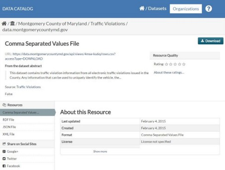
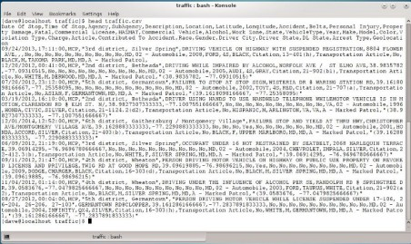
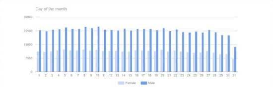
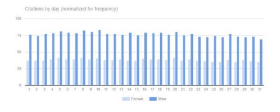
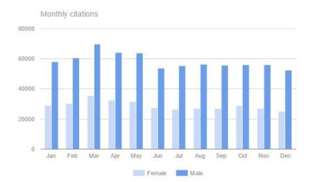
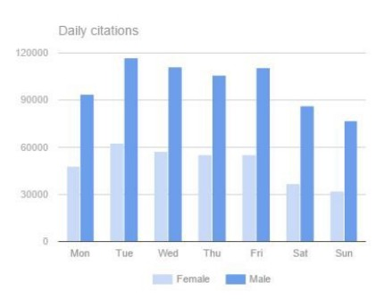

# Ticket to Ride
<br>
<p align="center"><kbd></kbd></p>
<br>

It's the end of the month and I have a long drive ahead of me. Will the police
be out in force trying to meet their monthly ticket quotas?

Do the police really have ticket quotas? The police say they don't. Most people
don't believe them.

Luckily, there’s some data available to help settle the question. The state of
Maryland has contributed a collection of traffic violation data to
[data.gov](https://data.gov/). It’s one of 300,000 data sets on the Data.gov
site that you can explore for free.

To find out more, follow along and explore the traffic ticket data set.

## Getting Started

A good study needs a hypothesis.

**Hypothesis**: The police issue more tickets at the end of the month because
they are trying to meet quotas.

One way to check this hypothesis is to compare daily ticketing rates over
several months. The metadata for the [Traffic
Violations](https://catalog.data.gov/dataset/traffic-violations) dataset says it
"contains traffic violation information from all electronic traffic violations
issued in the County". Sounds perfect.

<p align="center"><kbd></kbd></p>

## Prepare the data

Download the [csv
file](https://data.montgomerycountymd.gov/api/views/4mse-ku6q/rows.csv?accessType=DOWNLOAD).

Now that you have the file, the next step is to validate the data in it. This is
a crucial step in any data analysis. The traffic ticket data is stored in a
giant csv table. To make working with the data easier, create an SQLite database
and import the data from the file.

(The [Python script](./fix-and-load.py) that accompanies this post has the code
to set up the database and load the data.)

### Inspect the file

The csv file from Data.gov is about 375MB in size. It has just under 1.1 million
rows.

- Use the `head` command to see the first few rows.

```bash
head Traffic_Violations.csv
```

The output looks like this:

<p align="center"><kbd></kbd></p>

To spot check the data, run some checks with your system utilities before you
attempt to import the file. For example:

- Check the number of lines in the file

  ```bash
  wc -l Traffic_Violations.csv
  ```    `grep`.

- Check for the range of years. The second field is `Date of Stop`. This check
  was supposed to find the range of years in the file. Instead, it showed a large
  number of bad data entries.

  ```bash
  cut -f 2 -d"," < Traffic_Violations.csv | cut -f3 -d'/' | sort -u
  ```

When you encounter problems like this, you can try to fix the bad fields, you
can drop those rows entirely, or you can code around the problems later. You
will need to decide what's best based on your data and the questions you want to
answer.

### File format issues

The input file is a csv file. That could mean 'character separated values' or
'comma separated values'.

In the traffic violations file, commas are supposed to be reserved characters
that separate the fields in each row. But, commas are used within fields as
normal punctuation and as field separators. Even worse, the use of commas within
fields is inconsistent.

The different usage makes parsing the file tricky. For example, in some rows the
subagency (usually a geographic designation) sometimes has a comma in its name.
Sometimes it doesn't.  Geographic coordinates are sometimes reported as
"(latitude, longitude)". Sometimes they aren't.

There are other problems too. Many rows are sparse. They are missing values in
lots of their fields. Instead of trying to guess what should be there, the data
cleaning script drops rows that are too sparse.

This is the [Python script](./fix-and-load.py) that cleans the data and uploads
it to the SQLite database. Altogether the cleanup step drops about 1800 rows, a
little less than 1% of the total.

## Explore the data, set a date range

The data cleaning step reveals some problems with the date field. Dates are an
important element of this study, so it is important to handle the date field
carefully.

**NOTE**: As of March 2025, there is a new csv file. Unfortunately, the new file
has new problems. The discussion here follows the data in the old file.

### Set bounds

What should the upper and lower bounds be for the date field?

The file metadata says the last data update is in 2015. That sets an upper bound
for the dates.

To find the lower bound, run a `SELECT` query to check the possible values, then
choose a year that has a significant number of tickets and ignore earlier years
to avoid noise.

```sql
SELECT year, count(year) FROM alldata GROUP BY year;
```

The output looks like this:

```
0 809
4 3
5 1
6 3

<--SNIP-->

1990 3005
1991 3659
1992 5651
1993 6881
1994 12017
1995 16694

<--SNIP-->

2015 29480
2016 14522
2017 2022
2018 4

<--SNIP-->

9563 1
9867 1
9999 29
```

There are still significant numbers of rows in the early 1990s. But, the number
of rows per year drops off sharply before 1994. The study uses an arbitrary cut
off at 1990.

After combining the upper and lower bounds, the study period runs from 1990 to
2015.

### Parse the date field into subfields

In the csv file, the date is a single field that has the format `mm/dd/yyyy`.
That format is too course. The solution is to break apart the date and add
columns for the `year`, `month` and `day`.

Alternatively, you could use a database that has a `date` datatype. (SQLite
doesn't have a `date` data type.)

```python
def parse_date(date_of_stop_field):
    month, day, year = date_of_stop_field.split('/')
    day_of_week = datetime.date(int(year), int(month), int(day)).weekday()

    return "," + year + "," + month + "," + day + "," + str(day_of_week)
```

(This is the [source code](fix-and-load.py).)

## Visualize the data

To see ticketing trends, plot the number of tickets per day over a month. Here
is a first attempt at plotting the data.

<p align="center"><kbd></kbd></p>

There is a serious downward trend at the end of the month.

It the hypothesis is correct, tickets should trend upwards at the end of the
month.

What’s going on?

Months don't have uniform length. All months are 28 days long, not all months
are 31 days long. The first chart misrepresents the data.

The next view adjusts the chart to account for the length of different months.
It shows the number of tickets per `month-day`.

<p align="center"><kbd></kbd></p>

In terms of tickets per day, this graph is pretty even. It doesn't look like
there is a spike in tickets at the end of the month.

Perhaps the period is wrong. Maybe there is a weekly quota, or a yearly one.

The weekly data:

<p align="center"><kbd></kbd></p>

The yearly data:

<p align="center"><kbd></kbd></p>

The data doesn’t support either of those suggestions. In all cases, more
tickets are issued at the beginning of the period than at the end. This is true
for all of these periods:

- Day of the month
- Day of the week
- Month of the year

It is difficult to conclude that the the police mount a last minute ticket blitz
to meet quota each month.

That settles the argument then. Data doesn’t lie.

Or does it?

It turns out there are some difficulties with the data set.

## Difficulties with the data

A cursory look at these charts shows men consistently getting twice as many
tickets as women over the entire 15 year period. Men hover around 76 tickets per
day. Women get about 38 tickets per day. That's a surprising result.

The US Census website reports that Maryland has a slightly large proportion of
women (51.5%) than men (48.5%).

Still, the census figures are roughly equal. That suggests roughly numbers of
male and female drivers. Perhaps there is a selection bias that skews the data
in the data set.

There is.

All of the tickets in the data set are related to traffic accidents. The data
isn't 'all tickets'. It is 'all tickets from accidents'. That is a very
different data set.

It is certainly interesting to see that men involved in accidents get tickets
twice as often as women do. It is also interesting to see that accident rates
appear to be skewed towards beginning of each week and the beginning of each
month.

As interesting as it may be, the data in this data set isn't a good way to test
the hypothesis. This ticket data is overly specific, it's just a subset of all
ticket data.

## Conclusion

There is a lot of information to be has in publicly available data sets. It is
important to verify the integrity of the data. It is also important to carefully
match the scope of the data with the question being asked.

Now, it's time to find a better data set before my next road trip.

---

Originally posted to [Medium](https://medium.com/) on February 9, 2019.
Updated December, 20 2024.
Updated March, 6 2025.