# Chewing on the Twitter Feed


Twitter streams millions of messages all day long. Have you ever wanted to use
their feed to do your own analysis of streaming posts?

If so, follow along. That's what this post is about.


## Background

A few years ago, Assaf Mentzer put together a demonstration project, [Building a
Near Real-Time Discovery Platform with AWS]]
(https://aws.amazon.com/blogs/big-data/building-a-near-real-time-discovery-platform-with-aws/)
to introduce readers to streaming data. Since then AWS has made changed some of
the services he used.

This page updates Assaf’s instructions and adds a few additional tips for anyone
who wants to get started analyzing the Twitter feed.

The steps on this page extend Assaf’s post. For additional context, open Assaf’s
page in another browser tab so you can refer to his post too.

## Prerequisites

You need an AWS account and a Twitter account.

Consider creating a new Twitter account for this project instead of
reusing your usual one (if you already have one). The advantage of a new account
is that you can use different preferences and settings for this data exploration
project and you won’t have to modify your usual settings.

## Create an Amazon Elasticsearch Service cluster

### Sign in to the Elasticsearch Service Console.

1. If this is your first sign in to the Elasticsearch Console, select `Get
   Started`.

   If you have used the Elasticsearch Console before, select, `Create a New
   Domain`.

   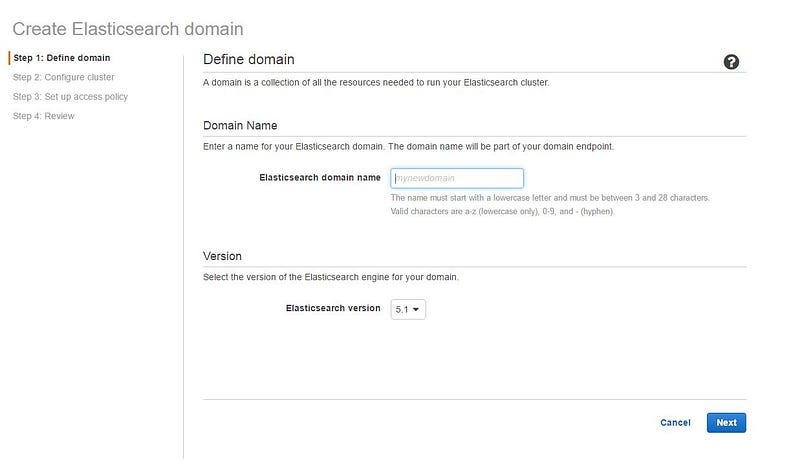

1. Name your domain then click `Next`. This example uses: “es-twitter-demo”.
1. Assaf recommends accepting the defaults on the next screen. It is cheaper to
   use a smaller EC instance to host the Elasticsearch domain. The
  `t2.medium.Elasticsearch` instance type works well for simple experiments.
1. Choose `Allow Open Access` as the domain policy. This is a poor security
  practice and the console will complain about it. If you want to do more than
  simple experimentation, configure a more restrictive security policy.

  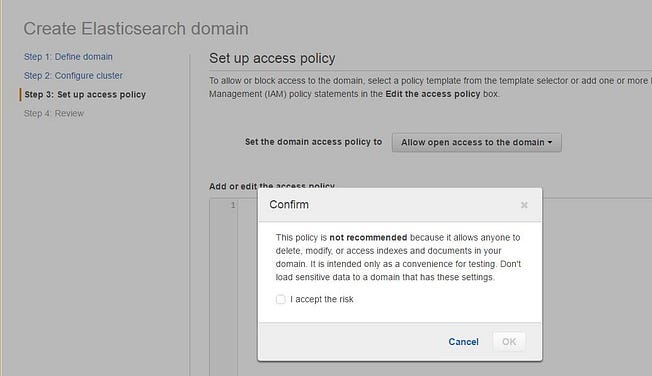

1. Choose `Confirm and Create`. It takes about 10 minutes to set up the domain.

   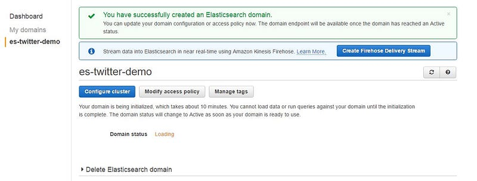

1. To confirm your domain configuration, click on the endpoint when it is active.

   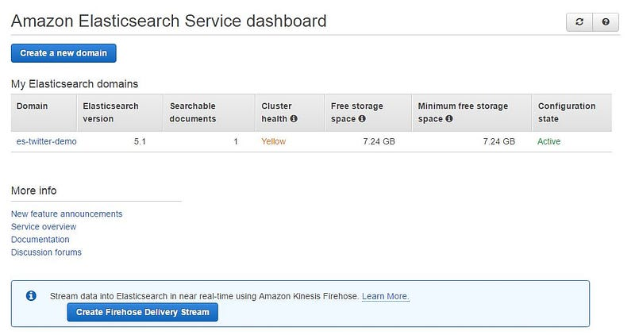

1. The service console displays configuration details for the new endpoint. Save
   this information down for later. Be sure to make a note of the Elasticsearch
   service endpoint and the Kibana URL.

   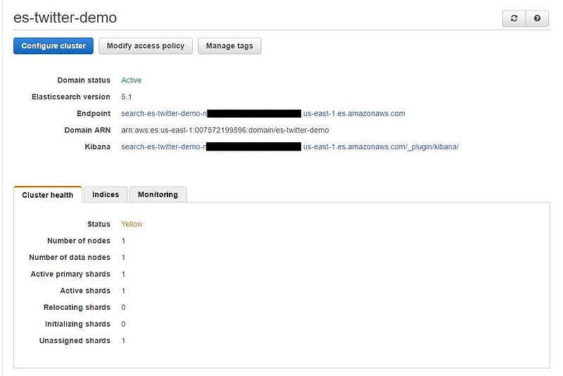

## Create an IAM role for Firehose

In this section, you create a role in AWS to work with the Twitter Firehouse
feed.

1. On your desktop, create two policy files.

   NOTE: If you cut and paste the configuration from original post, you may get
   hidden artifacts in the policy files. The uploads fails if the artifacts are
   there. If that happens, just retype the files manually. The syntax in the
   original article is correct.

1. Edit the `s3-rw-policy.json` file to use your S3 bucket.

   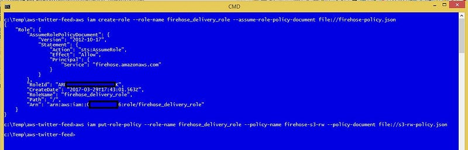

1. To upload the policy files, use the AWS CLI client.
1. Verify that the policy is in place.

   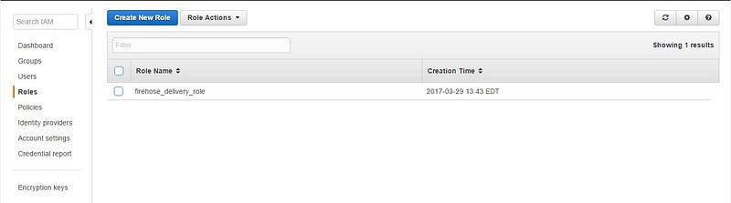

## Create a Lambda function

This section makes a lot of updates to the original post. The Lambda function
setup and the configuration process have changed considerably since Assaf's blog
post was published in 2015.

1. Download the deployment package.
1. Unzip the package to your project folder (`s3-twitter-to-es-python`).
1. Modify the `s3-twitter-to-es-python/config.py` file. Edit the file so that
   the value of `es_host` matches the Elasticsearch Service endpoint for your
   domain.

   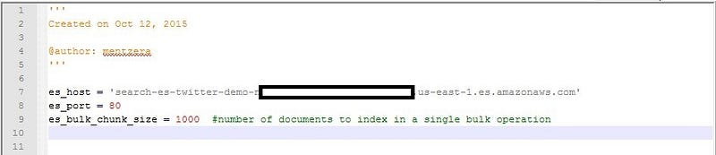

1. Zip the folder content in your local environment. This example uses
   `my-s3-twitter-to-es-python.zip`

   It is important to zip the entire folder contents. Don't zip up the folder by
   itself.
1. Sign in to the Lambda console.
1. If this is your first time using Lambda, select `Get started now`.

   If you have used Lambda before, select `Create a Lambda function`.
1. Select `Configure triggers` from the list of choices at top left of the
   screen.

   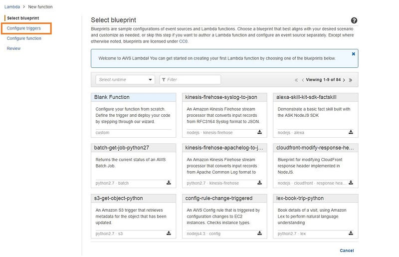

1. To select a storage location, click inside the dotted lines and select `S3`
   from the drop down list.

   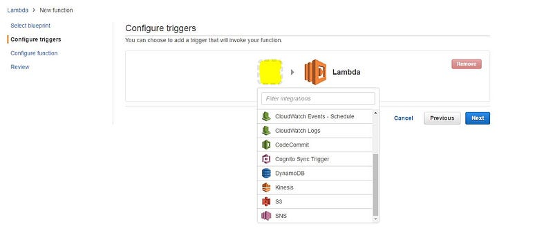

1. Enter your S3 bucket name. Verify that `Enable trigger` checked.

   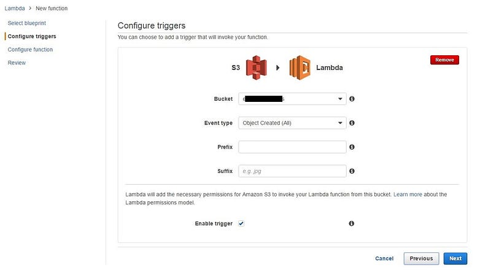

1. Use these values to update the variables on the next screen:

   ```
   # Your project name
   Name: 's3-twitter-to-es-python

   Runtime: 'Python2.7'

   Code entry: 'Upload a .ZIP file'
   # Click the button to upload the .zip file you created earlier

   Handler: 'lambda_function.lambda_handler'

   Role: 'Create new role from templates(s)'

   Role name: 'lamdba_s3_exec_role'

   Memory: 128

   Timeout: '2 minutes'
   ```

   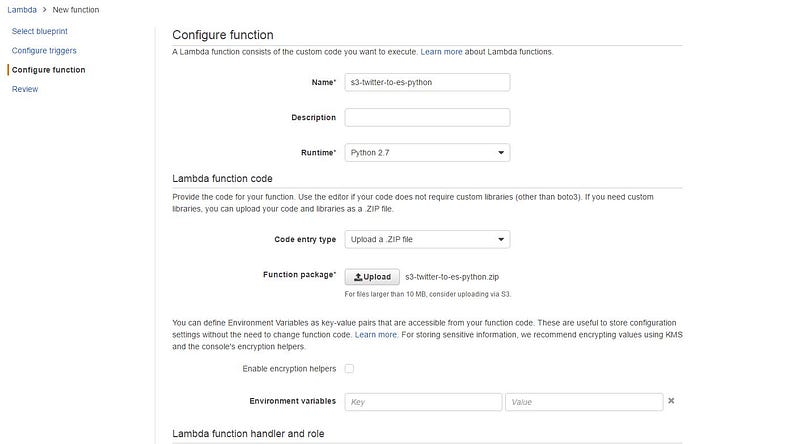

   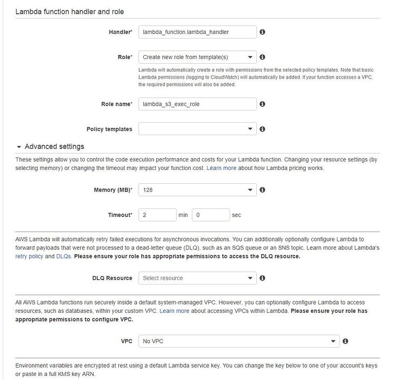

1. Create the function.
1. Verify that the role was created properly.

   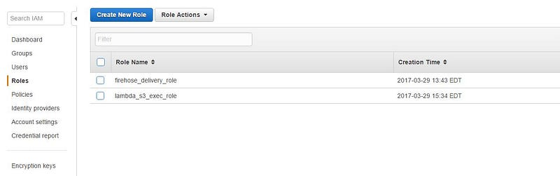

1. Verify the S3 bucket has permissions set properly.

   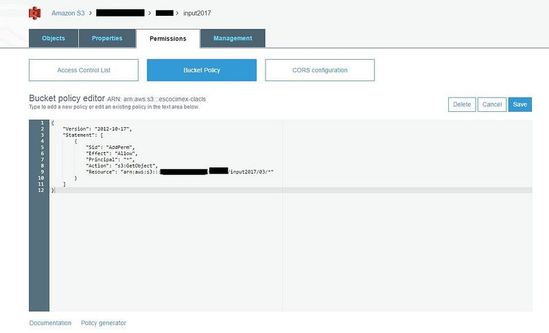

## Stream data from Twitter to AWS

Congratulations! You're nearly ready to try out the feed.

Assaf's configuration limits the Twitter feed to US data. It only sends a few of
the available fields. That's ok to get started.

The `t2.micro` server instance that hosts `node.js` host works well for Assaf's
demo. Later on, if you decide to pull in lots of data, you may want to upgrade
your server instance.

Here are some tips to reconfigure the data stream.

### Add countries from outside the US

This modification sends a LOT of additional data.

1. Connect to your node.js host.
1. Change to the `twitter-streaming-firehose-nodejs` directory.
1. Edit `config.js to` comment out the regional filter.

   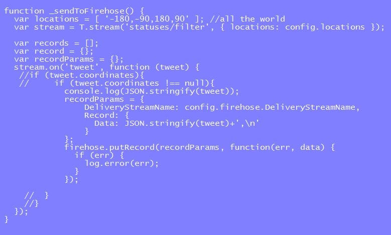

1. Restart the `node.js` server.

### Add fields to the Twitter stream

Tweets have a lot of metadata. The Lambda function only captures a small part of
it. To change the data the function captures, follow these steps.

1. Go to the project directory, `s3-twitter-to-es-python directory` in this
   example.

1. Edit `tweet_utils.py` to change the fields in the `get_tweets()`
   function.

   Rob Johnson has compiled a list of the [fields that are available]
   (https://gist.github.com/robjohnson/702360).

   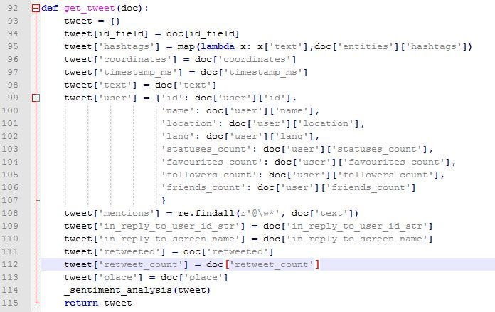

1. Zip up the local directory.
1. In the Lambda Management console, upload the new `.zip` file. The file
   replaces the old function.
1. To verify your changes, go to the monitoring tab and click on 'View logs in
   CloudWatch'.

   These logs are very useful to debug any errors that you may have in your
   python script.

   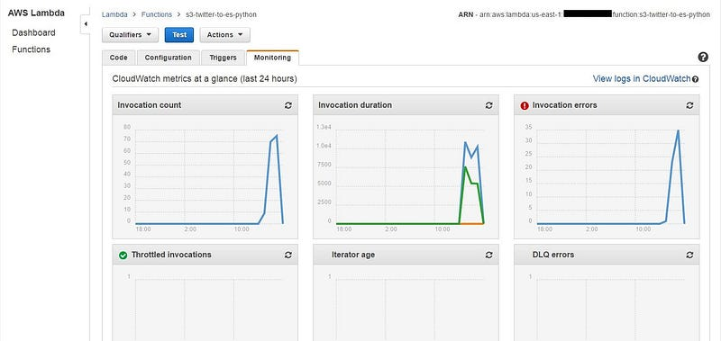

## Add indexes to Kibana

Kibana helps you to explore your data. If you change the data collection, you
should add new indexes to work with the new information stream.

To add an index, first create a new index in Kabana, then follow these steps to
update the project:

1. Go to the project directory, `s3-twitter-to-es-python directory` in this
   example.
1. Edit `twitter_to_es.py` to update the index name.

   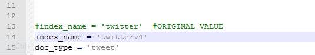

1. Zip up the local directory.
1. In the Lambda Management console, upload the new `.zip` file.
1. Verify that the new index is listed in the `Indices` tab for your
   Elasticsearch domain.

## What to expect

The Kinesis Firehose processes the incoming feed data. It writes a file to S3
every five minutes or when the new data reaches a certain size.

You should start to see files appearing in the S3 bucket very soon.

When a file appears in S3, the Lambda function processes it. Expect to start
seeing results about five minutes after you activate the project.

Elasticsearch creates a Kibana URL when you confirm your domain. To see a
visualization of your data, open the URL in a browser.

The page link isn't very interesting at first. Kabana only starts to update
after the Lambda function processes the first set of data. Let the stream run
for a while to generate some data, then start exploring.

Happy prospecting!

## Trouble shooting

If you don’t see any output from the lambda function, first verify that data is
being written to S3. Then, check that the S3 bucket permissions are correct for
reading.

The bucket permissions can be configured to be world readable since the data in
the bucket is already publicly available. If you are working with sensitive or
restricted data, use more restrictive access permissions.

Originally posted to [Medium](https://medium.com/) on January 9, 2019.