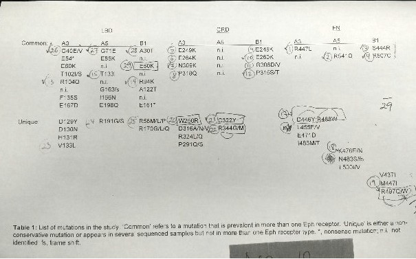

# Data Visualizations for Genetic Research

These are data explorations and visualizations I did in support of a genetic
research project.

Dr. Juha P. Himanen did the underlying research. In 2018 he presented the
results at the Second Congress on the Eph/Ephrin System in Parma, Italy. His
paper was titled: "Functional Relevance of the Head-to-Head vs Head-to-Tail Eph-Eph
Interactions for Receptor Activation."

I used Juypiter notebooks, matplotlib, numpy, pandas, and seaborn for the project.

These files are PDF versions of my rough, working copies of the notebooks.

- [Data sets 2016, 2017: Cleaning and transformation](010..2017-07-26.pdf)
- [Data set 2016: Analysis and visualization](020..2017-07-26.pdf)
- [Data set 2016: Time data](020a..2017-07-26-time-by-number.pdf)
- [Data set 2016: Miscellaneous charts](030..2017-07-26.pdf)
- [Data set 2017: Data cleaning and transformation](040..2017-07-26.pdf)
- [Data set 2017: Total Number x Total Area](050..2017-07-26.pdf)
- [Data set 2017: Total Number x Total Intensity](060..2017-07-26.pdf)
- [Data set 2017: Total Intensity by Total Area](070..2017-07-26.pdf)
- [Data sets 2016, 2017: Total Number x Total Area](080..2017-07-26.pdf)
- [Data sets 2016, 2017: Total Number x Total Intensity](090..2017-07-26.pdf)

These files are somewhat cleaner summaries.

- [Data cleaning and transformation](data-transformation.pdf)
- [Data Analysis and Visualization](data-analysis..2017-07-14..01.pdf)

These Python snippets are additional charts that were dropped from the project.

 - [Chart: area by time step](snippet_chart_area_at_each_time_step.py)
 - [Chart: protein receptor by mutants](snippet_compare_receptor_with_mutants.py)
 - [Summary statistics](summary_statistics.py)